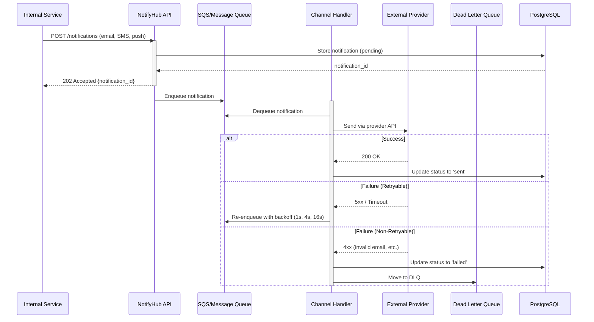
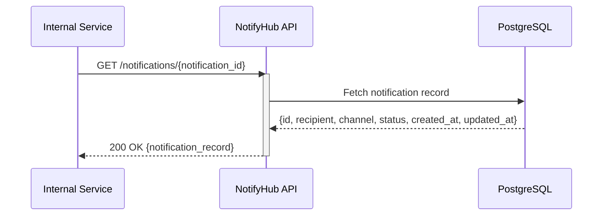

# NotifyHub: System Specification

**Version:** 1.0  
**Date:** 2026-08-20  
**Status:** Draft for Review

---

## 1. Executive Summary

NotifyHub is a lightweight, high-throughput notification dispatch service designed to handle email, SMS, and push notifications with automated retry logic and rate limiting. It serves as a centralized notification hub for internal microservices, enabling reliable, scalable notification delivery across multiple channels.

---

## 2. Core Functional Requirements

### 2.1 Notification Dispatch
- **Multi-channel support**: Email, SMS, and push notifications
- **Single unified API**: Clients submit notifications to NotifyHub via a REST API endpoint
- **Batch submission**: Support both single and batch notification submissions
- **Channel routing**: Automatically route notifications to appropriate channel handlers based on notification type

### 2.2 Channel Handlers
- **Email Handler**: Queue messages to email provider (e.g., SendGrid, AWS SES)
- **SMS Handler**: Queue messages to SMS provider (e.g., Twilio, AWS SNS)
- **Push Handler**: Queue messages to push notification provider (e.g., Firebase, AWS SNS)
- **Provider abstraction**: Pluggable provider backends to support multiple vendors per channel

### 2.3 Retry & Failure Handling
- **Automatic retry with exponential backoff**: Failed sends retry up to N times (configurable, default 3)
- **Exponential backoff strategy**: 1s, 4s, 16s delays between retries
- **Dead Letter Queue (DLQ)**: Failed notifications after max retries move to DLQ for manual inspection
- **Failure logging**: All failures logged with error details, timestamp, and provider response

### 2.4 Rate Limiting
- **Per-recipient rate limiting**: Prevent notification spam to individual recipients (e.g., max 10 emails/hour)
- **Per-channel rate limiting**: Respect provider limits (e.g., SMS provider throughput caps)
- **Graceful degradation**: Queue overflow requests with exponential backoff, do not reject

### 2.5 Notification State & History
- **Delivery tracking**: Track notification through states: `pending` → `sent` → `delivered` / `failed`
- **Audit log**: Maintain delivery logs for 90 days (see Section 3)
- **Query API**: Clients can query notification status by notification ID or recipient

### 2.6 Configuration & Templates
- **Template support**: Allow clients to submit notification templates (subject, body, variables)
- **Variable substitution**: Support dynamic variable injection (e.g., `{{user_name}}`, `{{action_link}}`)
- **Channel-specific templates**: Different templates for email vs. SMS vs. push (optional)

---

## 3. Non-Functional Requirements

### 3.1 Scale & Performance
| Metric | Target | Rationale |
|--------|--------|-----------|
| **Throughput** | 100–500 notifications/sec (baseline) | Startup phase, predictable workload |
| **Peak burst** | Up to 5× baseline (2,500/sec) | Campaign sends, marketing pushes |
| **API response latency** | < 200ms (p95) | Clients get quick acknowledgment |
| **End-to-end latency** | < 5 min (p95) for email; < 30s for SMS/push | Acceptable for most use cases |
| **Throughput limit** | Best-effort retry; no SLA guarantees | Acceptable for internal services |

### 3.2 Reliability & Data Retention
| Aspect | Requirement | Details |
|--------|-------------|---------|
| **Delivery guarantee** | Best-effort with retry | Retry up to 3 times, exponential backoff; no guarantee of delivery |
| **Failure handling** | DLQ + alerts | Failed notifications moved to DLQ after max retries; optional alerting |
| **Log retention** | 90 days | Supports audit trails and customer support inquiries; beyond 90 days, archive to S3 |
| **Data durability** | Persist notifications to database | Ensure no loss of notification intent between submission and delivery |

### 3.3 Security & Compliance
- **API authentication**: All REST API calls must include API key or signed request (AWS SigV4-style)
- **Encryption in transit**: All communication via HTTPS; mTLS for internal service-to-service
- **Encryption at rest**: Database and message queues encrypted at rest
- **PII handling**: Sensitive data (phone numbers, email addresses) logged but redacted in debug logs
- **Rate limiting**: Prevent abuse and DoS attacks

### 3.4 Operational Requirements
- **Monitoring**: CloudWatch dashboards for throughput, error rates, latency percentiles
- **Alerting**: PagerDuty/SNS alerts for:
  - DLQ size exceeding threshold
  - Provider API errors or rate limit hits
  - Database or queue service degradation
- **Observability**: Structured logging (JSON) and distributed tracing support (X-Ray)
- **Deployment**: Blue-green deployment support, rollback capability

---

## 4. Out of Scope

### Explicitly Out of Scope
- **In-app notifications**: NotifyHub focuses on external channels (email, SMS, push). In-app messaging should use a dedicated service.
- **User preference management**: Notification frequency capping, opt-out handling — delegate to caller
- **Templating engine**: Advanced template rendering (e.g., Jinja2, Handlebars) — support basic variable substitution only
- **Webhooks / callback delivery**: Providers will call notifyHub with delivery status; we do not implement provider-agnostic webhooks back to clients
- **Multi-tenant isolation**: Single-tenant service; no namespace/org separation (can add later)
- **Analytics & reporting**: No built-in dashboards for notification trends; raw logs available for ETL

### Nice-to-Have (Not MVP)
- Multiple provider support per channel (e.g., fallback from SendGrid to AWS SES)
- Scheduled notifications (send at specific time)
- Notification templating UI
- Advanced rate limiting (sliding window, per-user-segment)
- Webhook callbacks to notify clients of delivery status

---

## 5. User & API Flows

### 5.1 Notification Submission Flow



### 5.2 Notification Status Query Flow



### 5.3 REST API Endpoints

#### Submit Single Notification
```
POST /notifications
Authorization: Bearer {api_key}
Content-Type: application/json

{
  "recipient": "user@example.com",
  "channel": "email",
  "subject": "Order Confirmation",
  "body": "Your order {{order_id}} has been confirmed.",
  "template_vars": {
    "order_id": "ORD-12345"
  }
}

Response: 202 Accepted
{
  "notification_id": "uuid-1234",
  "status": "pending",
  "created_at": "2026-08-20T10:30:00Z"
}
```

#### Submit Batch Notifications
```
POST /notifications/batch
Authorization: Bearer {api_key}
Content-Type: application/json

{
  "notifications": [
    { "recipient": "user1@example.com", "channel": "email", ... },
    { "recipient": "user2@example.com", "channel": "sms", ... }
  ]
}

Response: 202 Accepted
{
  "batch_id": "batch-uuid",
  "submitted": 2,
  "notification_ids": ["uuid-1", "uuid-2"]
}
```

#### Query Notification Status
```
GET /notifications/{notification_id}
Authorization: Bearer {api_key}

Response: 200 OK
{
  "notification_id": "uuid-1234",
  "recipient": "user@example.com",
  "channel": "email",
  "status": "sent",
  "created_at": "2026-08-20T10:30:00Z",
  "updated_at": "2026-08-20T10:31:15Z",
  "provider_response": null
}
```

#### Query Batch Status
```
GET /notifications/batch/{batch_id}
Authorization: Bearer {api_key}

Response: 200 OK
{
  "batch_id": "batch-uuid",
  "submitted": 2,
  "sent": 1,
  "failed": 1,
  "pending": 0,
  "notifications": [...]
}
```

#### Inspect Dead Letter Queue
```
GET /dlq
Authorization: Bearer {api_key}

Response: 200 OK
{
  "dlq_size": 15,
  "notifications": [
    {
      "notification_id": "uuid-dead",
      "reason": "Invalid email address",
      "attempts": 3,
      "last_error": "550 User not found"
    }
  ]
}
```

---

## 6. High-Level Architecture (AWS)

### Components
1. **API Gateway + Lambda** (or ECS/Fargate): REST API entry point, request validation
2. **SQS**: Message queue for async processing
3. **Lambda (async)**: Channel handlers (email, SMS, push) that consume from SQS
4. **RDS PostgreSQL**: Notification state, audit logs, DLQ storage
5. **CloudWatch**: Metrics, logs, alarms
6. **Secrets Manager**: API keys, provider credentials

### Data Flow
```
Client → API Gateway → Lambda (sync) → RDS (store) + SQS (enqueue)
                                              ↓
                                    Lambda (async) → Provider → RDS (update status)
                                              ↓
                                    DLQ (on failure)
```

---

## 7. Success Metrics (MVP)

| Metric | Target | Owner |
|--------|--------|-------|
| API latency (p95) | < 200ms | Backend |
| Queue processing latency | < 1 min (p95) | Operations |
| Provider success rate | > 98% | Channel handlers |
| DLQ size | < 100/day | Monitoring & alerting |
| Database uptime | > 99.5% | DevOps |

---

## 8. Rollout Plan

### Phase 1: MVP (Week 1-2)
- Single internal API with email channel
- Retry logic + DLQ
- Basic rate limiting
- RDS + SQS + Lambda

### Phase 2: Expansion (Week 3-4)
- Add SMS and push channels
- Batch submission API
- Status query API
- Monitoring & alerting

### Phase 3: Production Ready (Week 5-6)
- Load testing (verify 500/sec capacity)
- Security audit (encryption, auth)
- Runbook & operational readiness
- Go-live

---

## 9. Assumptions & Dependencies

### Assumptions
1. Internal services can manage their own notification templates (we provide variable substitution only)
2. Clients can retry API requests with idempotency keys to avoid duplicates
3. External providers (SendGrid, Twilio, Firebase) are stable and available
4. AWS SQS and RDS are acceptable for the MVP (no multi-cloud requirement)

### Dependencies
- AWS account with permissions for Lambda, SQS, RDS, CloudWatch, Secrets Manager
- Integration credentials for email, SMS, and push providers
- Monitoring/alerting tool (PagerDuty, CloudWatch Alarms)

---

## 10. Appendix: Glossary

| Term | Definition |
|------|-----------|
| **Channel** | Delivery method (email, SMS, push) |
| **Provider** | External service (SendGrid, Twilio, Firebase) |
| **DLQ** | Dead Letter Queue; failed notifications stored here for manual review |
| **Notification** | A message to be delivered to a recipient via a channel |
| **Idempotency Key** | Client-provided key to prevent duplicate submissions |
| **Rate Limiting** | Throttling notifications to respect limits and prevent abuse |

---

**Next Steps:**
1. Review this specification with stakeholders
2. Identify any gaps or conflicts
3. Proceed to system design & architecture phase
4. Begin MVP implementation planning
